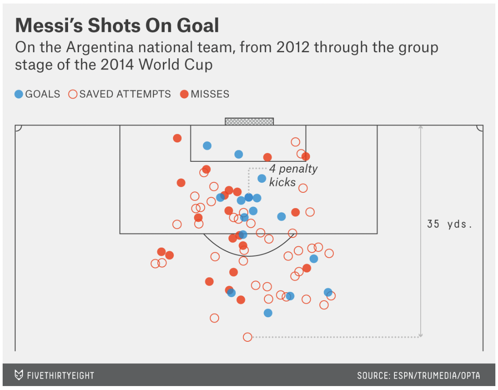
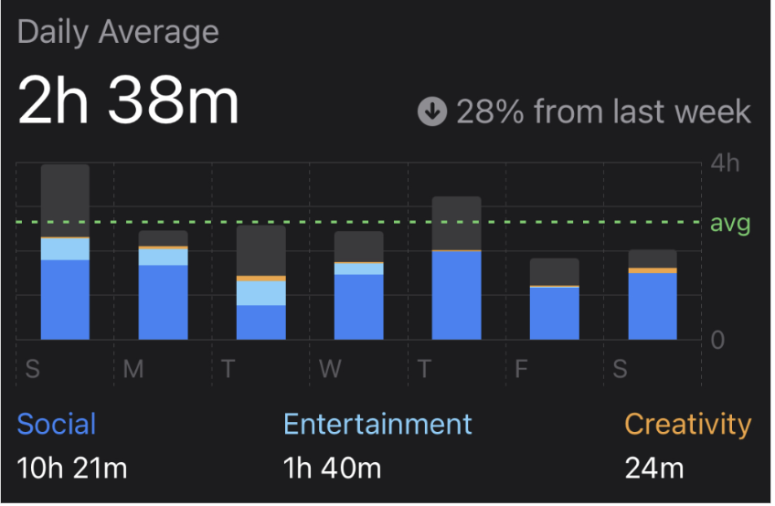

```{r setup, include=TRUE}
knitr::opts_chunk$set(echo = TRUE)
library(tidyverse)
library(lubridate)
library(ggrepel)
```

## 1) Graphics from FiveThirtyEight

#### A) Screenshot of the graphic

```{r out.width='85%', echo = FALSE, fig.align= 'center', fig.cap="Caption"}

```

#### B) Link of the webpage, name of the authors/designers of the related article.

<https://fivethirtyeight.com/features/lionel-messi-is-impossible/> 

- Title: Lionel Messi is impossible 
- Authors: Benjamin Morris 
- Source of the graph: ESPN/TRUMEDIA/OPTA

#### C) Description/explanation of its context:

-   The graph shows soccer player, Lionel Messi's shots on Goal. The three colors represent the variables, which are blue, red circle, and red colors and they each represents Goals, Saved Attempts, and Misses. There isn't a time period associated with it, since it's a visualization of a soccer ground where a player took a shot. The type of the visualization is somewhat like a scatter plot, but rather than using the original x and y axis, it's showing plots as where the player was.

#### D) What color scheme (if any) is being used in the graphic?

-   As mentioned, It uses three colors, and the colors used are red, red circles and blue to show the distinguish goals, misses and saved attempts. Without visually overwhelming, it uses natural colors to interpret the information which was visible, also standing out of where the goal was taken. In the perspective of the user, it was easy to distinguish the differences and was definitely readable.

#### E) Taking into account the so-called "Data-Ink ratio", explain whether the graphic seems to be maximizing this ratio or not.

-   First to define the "Data-Ink ratio", This measure is the ratio of the amount of ink used in graphing the data to the total amount of ink in the graph. The closer to zero this ratio gets, the worse the graph (Wainer,139) That is, graphing the essential information only, to make it look visible and discarding other features like the color, text...etc., making it simple. Applying that Data-Ink ratio into the given graph, I think it's doing well. It's using colors that might look distinctive only to show variables and it doesn't use unnecessary colors in the backgrounds, nor the way it displays it. Following graph seems to maximize this ratio, that is making it bigger, maximizing the data-ink, and discarding non data-ink.

#### F) Describe the things that you find interesting about the chosen graphic

-   It was interesting as it looks like a scatter plots, but without x and y it was showing freely as in the format of a soccer field of where the goal was taken. It gave a sense that it doesn't always have to be in a certain format, but in formats like this to interpret differently. But in such format as well, it was readable for the readers. I think as long as it's reader friendly, the way the people interpret the visualizations can be accepted. Adding on, the colors that were used, I didn't know that the difference between the usage of red and red circles could be so different and distinguishable.

## 2) Screen Time Graph

```{r out.width='85%', echo = FALSE, fig.align= 'center', fig.cap="Caption"}

```

#### 2.1) Graphic's Assessment

-   This bar-chart was built in the purpose of showing the average screen time for the user. So, assessing by the usage, I think it's a well organized data visualization. First to talk about the goodness of it, I like how the average is shown in the x-axis to compare the graph in a whole. From daily basis, it distinguishes the usage by using different color for each different category. The color is well used as it uses different shade even with the similar color, which enables for the user to view the difference easily, also the average color was definitely highlighting the average usage. For the cons, I think it could've been better if the hours are written more precisely as it was hard to tell the hours that were actually used in every day but just getting the estimation of it.

#### 2.2) Replicate Screen Time's Barchart

```{r}
Days <- c('Sunday', 'Monday', 'Tuesday', 'Wednesday', 'Thursday', 'Friday', 'Saturday')
Social <- c(107, 100, 46, 88, 117, 69, 98)
Entertainment <- c(29, 22, 32, 14, 0, 1, 0)
Creativity <- c(1, 3, 8, 1, 1, 1, 9)
Other <- c(101, 22, 69, 44, 72, 39, 46)

screentime <-data.frame(Days, Social, Entertainment, Creativity, Other)

screen_time <- (Social + Entertainment + Creativity + Other) / 60

average <- mean(screen_time)

screentime1 <- data.frame(Days =c('Sunday', 'Monday', 'Tuesday', 'Wednesday', 'Thursday', 'Friday', 'Saturday'), 
                          Social = c(107, 100, 46, 88, 117, 69, 98)/60,
                          Entertainment = c(29, 22, 32, 14, 0, 1, 0)/60,
                          Creativity = c(1, 3, 8, 1, 1, 1, 9)/60,
                          Other = c(101, 22, 69, 44, 72, 39, 46)/60
                          )

pivot <- screentime1 %>% pivot_longer(cols=c("Social","Entertainment","Creativity","Other"), names_to = "Category", values_to = "Time")

ggplot(pivot, aes(x=factor(Days, level = c('Sunday', 'Monday', 'Tuesday', 'Wednesday', 'Thursday', 'Friday', 'Saturday')), y=Time, fill=Category, width = 0.6)) + geom_col() + geom_bar(stat="identity")+ geom_hline(aes(yintercept= average)) + labs(x="Days", y="Time(Hours)", title = "Daily Average", subtitle="2h 43m", caption = "Creativity = 24min Entertainment = 1h 36m Other = 6h 35m Social = 10h 42m") + theme_dark() + theme(legend.position="bottom", plot.caption= element_text(face="bold", hjust=0.5, size = 11))

```

#### 2.3) Improved Alternative Screen Time Visualization

```{r}
ggplot(pivot, aes(x=factor(Days, level = c('Sunday', 'Monday', 'Tuesday', 'Wednesday', 'Thursday', 'Friday', 'Saturday')), y=Time, fill=Category, width = 0.6)) + geom_col() + geom_bar(stat="identity")+ geom_hline(aes(yintercept= average), linetype ="longdash", color = "#65cb66") + labs(x="Days", y="Time(Hours)", title = "Daily Average", subtitle="2h 43m", caption = "Creativity = 24min Entertainment = 1h 36m Other = 6h 35m Social = 10h 42m") + theme_dark() +scale_fill_manual("Category", values = c("Creativity"="#f0a43b", "Entertainment"="#3a3a3c", "Other"="#81cffb", "Social"="#3883f6")) + theme(legend.position="bottom", plot.caption= element_text(face="bold", hjust=0.5, size =11))
```

-   What I thought could be an better visualization, was improving the readability by changing the color. Following the screentime screenshot given initially, I used the color picker that was introduced in the lecture to get the colors of them, making it look similar and improving the experience for the users to view them more clearly on identifying the difference. However, I've changed the color for the other and entertainment, since it was part close to Social but black color between skyblue and blue did not look suitable, so changed the color for other and entertainment, which is different from the screenshot. Also, using the longdash function, have changed the yintercept line to somewhat more visible using the same color as the given screenshot. I think it's somewhat more visible than the visualization that I've made in the previous 2.2.

## 3) Cal Women's Basketball 2021-2022 Game-by-Game Scores

#### 3.0) Importing Data

```{r}
# import using 'read.csv()'
games = read.csv(
file = "cal-women-basketball-21-22.csv",
stringsAsFactors = FALSE,
colClasses = c(
"numeric", # Game
"character", # Opponent
"character", # Home_Away
"Date", # Date
"numeric", # Cal_Score
"numeric", # Opp_Score,
"numeric", # FG_attempted,
"numeric", # FG_made,
"numeric", # FG3_attempted,
"numeric" # FG3_made,
))
```

#### 3.1) Data Visualization

```{r}
game <- c(1,2,3,4,5,6,7,8,9,10,11,12,13,14,15,16,17,18,19,20,21,22,23,24)
cal_scores <- c(90,70,81,64,82,45,73,67,102,89,73,42,53,74,62,54,56,75,98,47,59,60,67,60)
opp_scores <- c(71,41,49,54,73,64,72,84,60,73,55,69,88,97,59,59,73,80,53,52,68,61,73,66)
home_away <- c("away","home","away","home","away","away","away","home","away","away","away","home","away","home","home","home","away","away","away","home","home","away","away","home")
df<- data.frame(home_away)

ggplot(games, aes(x= Game)) +
  geom_line(aes(y=cal_scores, colour = "Cal"),size=1) +
  geom_line(aes(y=opp_scores, colour = "Opp"),size=1) +
  labs(title="Cal's Game-by-Game performance over the 2021-2022 season", 
       subtitle="Women Basketball", 
       caption="Source:https://calbears.com/sports/womens-basketball/stats/?path=wbball#game",y="scores",color=NULL) +
  scale_color_manual(name="Team",values =c("Cal" ="steelblue", "Opp"="red")) +
   scale_x_continuous(breaks = round(seq(min(games$Game), max(games$Game), by = 1),1))+
theme(plot.caption=element_text(hjust=2.3), plot.title= element_text(face="bold", hjust=1),plot.subtitle=element_text(face="bold")) +annotate(geom="text", x= 1, y=40, label="away", size=1.7) +annotate(geom="text", x= 2, y=40, label="home", size=1.7)+annotate(geom="text", x= 3, y=40, label="away", size=1.7)+annotate(geom="text", x= 4, y=40, label="home", size=1.7)+annotate(geom="text", x= 5:7, y=40, label="away", size=1.7)+annotate(geom="text", x= 8, y=40, label="home", size=1.7)+annotate(geom="text", x= 9:11, y=40, label="away", size=1.7)+annotate(geom="text", x= 12, y=40, label="home", size=1.7)+annotate(geom="text", x= 13, y=40, label="away", size=1.7)+annotate(geom="text", x= 14:16, y=40, label="home", size=1.7)+annotate(geom="text", x= 17:19, y=40, label="away", size=1.7)+annotate(geom="text", x= 20:21, y=40, label="home", size=1.7)+annotate(geom="text", x= 22:23, y=40, label="away", size=1.7)+annotate(geom="text", x= 24, y=40, label="home", size=1.7)
```

-   The following graph that I produced compares the scores of the Cal basketball team and the opponents. Each x-axis and y-axis represents the number of the game and its score. I used different contrasting colors, labeling them Cal and Opp for the reader to distinguish them. As it was important to know the scores for each different game, I changed the tick mark range from 1 to 24, so that it can show each different game, so that the reader can follow up to see how much the team has scored in the game. For the caption I have wrote the source of the data, and used bold texts only on the title and the subtitle. As using the geom_line function to compare the numbers, to look more visible I changed the size, the boldness of the lines to make it look better. Additionally, I have also input the home, away so that it was to see where the tournament have took place,a source that can contribute to understanding of the whole performance of the Cal team.
